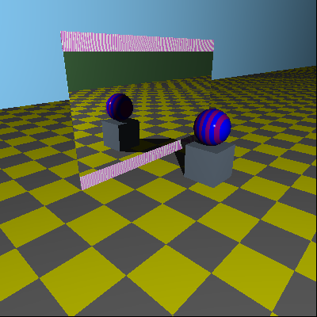

# Mirror

``` go

    // width, height := 300.0, 300.0
    // width, height := 400.0, 400.0
    width, height := 1000.0, 1000.0

    // setup world, default light and camera
    w := tracer.NewDefaultWorld(width, height)
    w.Config.MaxRecusions = 1

    // override light here
    w.SetLights([]tracer.Light{
        tracer.NewPointLight(tracer.NewPoint(10, 8, -10), tracer.NewColor(1, 1, 1)),
    })

    // where the camera is and where it's pointing; also which way is "up"
    from := tracer.NewPoint(3.5, 3.8, -5.7)
    to := tracer.NewPoint(-2, 0, 0)
    up := tracer.NewVector(0, 1, 0)
    cameraTransform := tracer.ViewTransform(from, to, up)
    w.Camera().SetTransform(cameraTransform)

    // floor
    floor := tracer.NewPlane()
    // floor.Material().Color = tracer.ColorName(colornames.Gray)
    floor.Material().Specular = 0
    floor.Material().Reflective = 0
    floorP := tracer.NewCheckerPattern(tracer.ColorName(colornames.Gray), tracer.ColorName(colornames.Yellow))
    floor.Material().SetPattern(floorP)
    w.AddObject(floor)

    leftWall := tracer.NewPlane()
    leftWall.Material().Color = tracer.ColorName(colornames.Lightskyblue)
    leftWall.Material().Specular = 0
    leftWall.Material().Reflective = 0
    leftWall.SetTransform(
        tracer.IM().RotateZ(math.Pi/2).Translate(-15, 0, 0))
    w.AddObject(leftWall)

    rightWall := tracer.NewPlane()
    rightWall.Material().Color = tracer.ColorName(colornames.Lightgreen)
    rightWall.Material().Specular = 0
    rightWall.Material().Reflective = 0
    rightWall.SetTransform(
        tracer.IM().RotateZ(math.Pi/2).Translate(15, 0, 0))
    w.AddObject(rightWall)

    // mirror1
    cube1 := tracer.NewUnitCube()
    cube1.SetTransform(
        tracer.IM().Scale(0.01, 1.5, 3).Translate(-2, 1.9, 0))
    cube1.Material().Reflective = 1
    cube1.Material().Color = tracer.ColorName(colornames.Black)
    w.AddObject(cube1)

    // border
    borderStripes := tracer.NewStripedPattern(
        tracer.ColorName(colornames.Lightgray), tracer.ColorName(colornames.White))
    borderStripes.SetTransform(tracer.IM().Scale(0.01, 1, 1).RotateY(math.Pi / 2))
    borderP := tracer.NewPertrubedPattern(borderStripes, 0.1)
    // this produces a completely different pattern than applying the transform on the inner pattern
    // borderP.SetTransform(tracer.IM().Scale(0.1, 1, 1).RotateY(math.Pi / 2))

    // top border
    topBorder := tracer.NewUnitCube()
    topBorder.SetTransform(tracer.IM().Scale(0.01, .2, 3).Translate(-2, 3.6, 0))
    topBorder.Material().SetPattern(borderP)
    w.AddObject(topBorder)

    // bottom border
    bottomBorder := tracer.NewUnitCube()
    bottomBorder.SetTransform(tracer.IM().Scale(0.01, .2, 3).Translate(-2, 0.2, 0))
    bottomBorder.Material().SetPattern(borderP)
    w.AddObject(bottomBorder)

    // left border
    leftBorder := tracer.NewUnitCube()
    leftBorder.SetTransform(tracer.IM().Scale(0.01, 1.9, 0.2).Translate(-2, 1.9, -3.2))
    leftBorder.Material().SetPattern(borderP)
    w.AddObject(leftBorder)

    // right border
    rightBorder := tracer.NewUnitCube()
    rightBorder.SetTransform(tracer.IM().Scale(0.01, 1.9, 0.2).Translate(-2, 1.9, 3.2))
    rightBorder.Material().SetPattern(borderP)
    w.AddObject(rightBorder)

    // table
    table := tracer.NewUnitCube()
    table.SetTransform(
        tracer.IM().Scale(0.5, 0.5, 0.5).Translate(0, 0.5, 0))
    table.Material().Reflective = 0
    table.Material().Color = tracer.ColorName(colornames.Lightslategray)
    w.AddObject(table)

    // sphere1
    sphere1 := tracer.NewUnitSphere()
    sphere1.SetTransform(
        tracer.IM().Scale(.5, .5, .5).Translate(0, 1.5, 0)) // half sphere + full cube (scaled by half())
    // sphere1.Material().Color = tracer.ColorName(colornames.Yellow)
    sphere1pattern := tracer.NewStripedPattern(
        tracer.ColorName(colornames.Blue), tracer.ColorName(colornames.Purple))
    sphere1pattern.SetTransform(tracer.IM().Scale(0.2, 1, 1))
    sphere1.Material().SetPattern(sphere1pattern)
    w.AddObject(sphere1)

    canvas := w.Render()

    // Export
    f, err := os.Create("image.png")
    if err != nil {
        log.Fatalln(err)
    }

    log.Printf("Exporting canvas to %v", f.Name())
    canvas.ExportToPNG(f)
}
```


