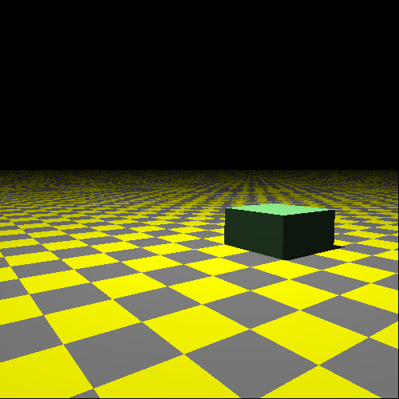
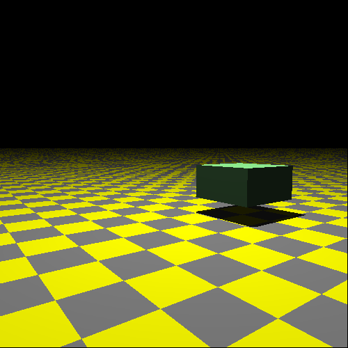

# Notes

## General

- Usually you scale first, then rotate and finally translate.

## translate and scale

This is a unit cube created with:

``` go
cube := tracer.NewUnitCube()
cube.Material().Color = tracer.ColorName(colornames.Lightgreen)
// cube.SetTransform(tracer.IdentityMatrix().Translate(0, 1, 0).Scale(1, .5, 1))
// cube.SetTransform(tracer.IdentityMatrix().Scale(1, .5, 1).Translate(0, 1, 0))
w.AddObject(cube)
```

**Translate, then scale**.

``` go
cube.SetTransform(tracer.IdentityMatrix().Translate(0, 1, 0).Scale(1, .5, 1))
```



**Scale, then translate.**

``` go
cube.SetTransform(tracer.IdentityMatrix().Scale(1, .5, 1).Translate(0, 1, 0))
```


